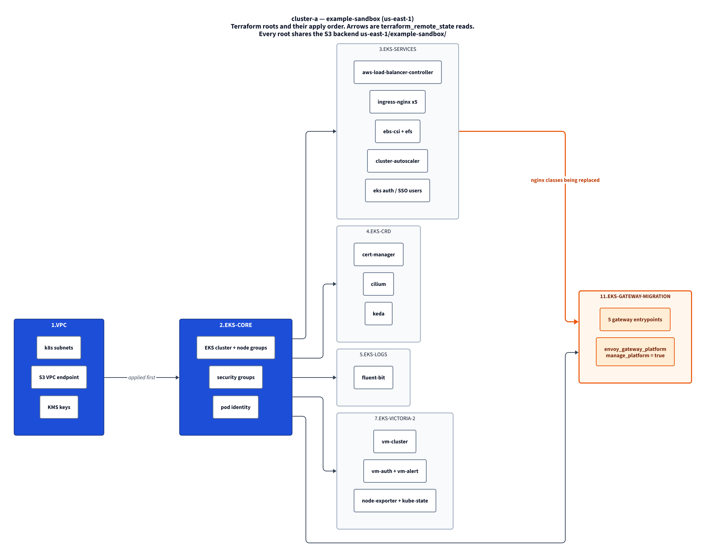
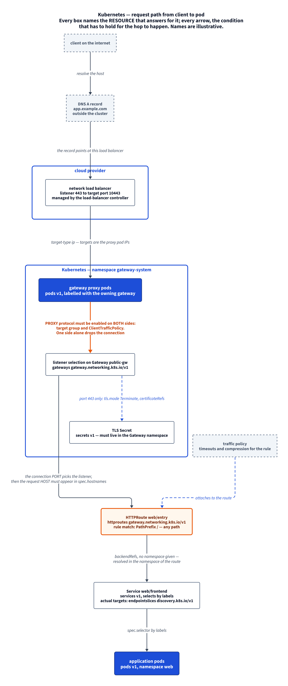
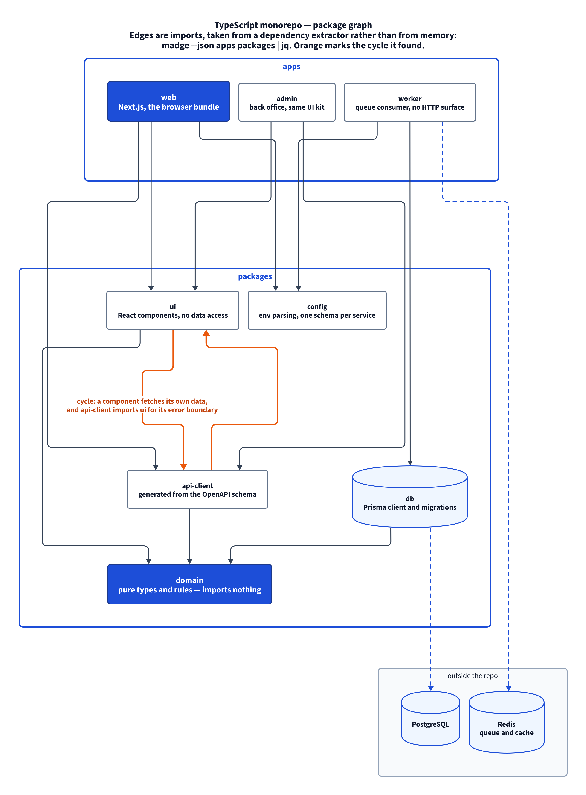
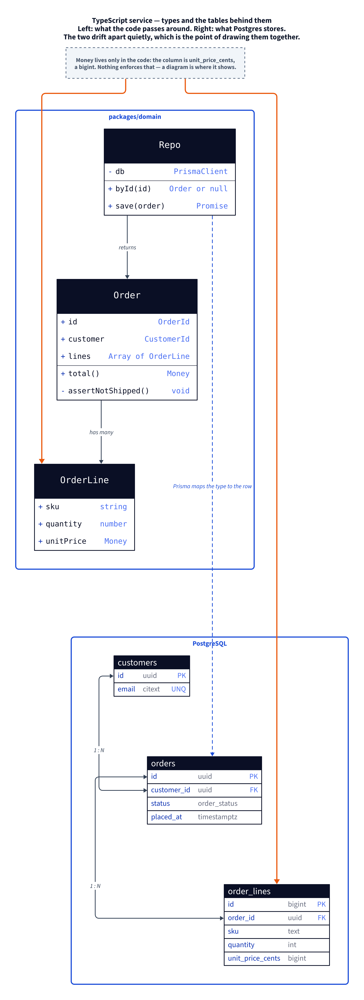

# d2-diagram

Ask an assistant for an architecture diagram and you usually get one of two
things: a Mermaid block that renders but looks like every other Mermaid block, or
several hundred lines of hand-placed SVG that nobody will ever edit again.

This skill takes the third route. The assistant writes a few dozen lines of
[D2](https://d2lang.com), a layout engine places the boxes, and the result is a
PNG committed next to the source. The diagram lives in git, changes in the same
pull request as the code, and its diff is readable.

Works with Claude Code, Opencode and Codex on Linux and macOS.

[Русская версия](README.RU.md)

## Why

A diagram is documentation that rots fastest, because editing it costs more than
ignoring it. Two habits make that worse:

- **A picture with no source.** An SVG produced by hand cannot be changed
  without redoing the work. So it is not changed, and within a month it
  describes a system that no longer exists.
- **A source nobody reviews.** Five hundred lines of `<path d="M…">` in a pull
  request is not something a reviewer reads. The change goes in unchecked.

D2 fixes both by separating them. Adding a component is one line:

```d2
private: Private subnets {
  eks: EKS node group
  rds: RDS Postgres {shape: cylinder}
}

internet -> public.alb: ":443"
public.alb -> private.eks: ":8080"
private.eks -> private.rds: ":5432"
```

Coordinates are not your problem — `dagre` or `elk` computes them. The pull
request shows `+ rds: RDS Postgres`, not a wall of coordinates.

## Install

```bash
git clone https://github.com/vadbosh/d2-diagram.git
cd d2-diagram
./install.sh              # every assistant found
./install.sh --dry-run    # show what would happen
```

The skill goes into `~/.claude/skills/d2-diagram`,
`~/.config/opencode/skills/d2-diagram` and `~/.codex/skills/d2-diagram` —
whichever of those exist. An assistant that is not installed is skipped, not
created.

The skill is useless without the `d2` binary, so a missing one is offered for
installation: the installer resolves the latest release for your OS and
architecture and unpacks it into `~/.local/bin`. On a terminal it asks first and
defaults to no; `--with-d2` skips the question, `--no-d2` suppresses it.

Upstream also offers a `curl … | sh` one-liner. This repository does not use it
and does not recommend it — piping a downloaded script straight into a shell
executes whatever the endpoint served, and the same result is one archive away:

```bash
tag=$(curl -fsSL https://api.github.com/repos/terrastruct/d2/releases/latest \
      | sed -n 's/.*"tag_name" *: *"\([^"]*\)".*/\1/p' | head -1)
curl -fsSL -o d2.tar.gz \
  "https://github.com/terrastruct/d2/releases/download/$tag/d2-$tag-linux-arm64.tar.gz"
tar xzf d2.tar.gz
install -m 0755 "d2-$tag/bin/d2" ~/.local/bin/d2
```

Details, flags and verification: [docs/install.en.md](docs/install.en.md).

## Use

There is nothing to invoke. Start a new session in the repository you want
drawn, and ask in plain words — the skill triggers on the request itself.

**1. Open the assistant where the code is.**

```bash
cd ~/work/my-service
claude          # or: opencode / codex
```

**2. Ask for the diagram, and say what it should answer.**

That second half is what separates a useful diagram from a box collage. Compare
"draw the architecture" with "show which services talk to the database, and
which of those calls go through the cache" — the first invites everything, the
second has an answer that can be right or wrong.

Prompts that work as typed — copy one and change the paths:

```
From the code in this repository, draw a diagram of the modules and how they
talk to the database. Save it in docs/diagrams/.

Draw the architecture: what runs where, and what calls what. Read the code,
do not guess.

Map the imports between packages in src/ and show me whether there are
cycles. Use a dependency tool to get the edges.

Draw the path of an HTTP request from the load balancer down to the database,
and mark what has to be true at each hop.

Diagram the data model: the TypeScript types on one side, the Postgres tables
on the other, so I can see where the two disagree.

Redraw this Mermaid block as a D2 diagram and put it in docs/diagrams/.
```

### Terraform is a special case — the graph already exists

For infrastructure you should not be asking anyone to read `.tf` files by eye.
Terraform can print its own dependency graph, and the state knows what is really
deployed. Say so in the prompt and the diagram stops being an interpretation:

```
Build the diagram from `terraform graph` rather than from reading the files.

Draw what is actually deployed, not what the configuration says: take the
resources from `terraform state list` and `terraform show -json`.

Draw how the root modules depend on each other — the edges are the
`terraform_remote_state` blocks, one per cross-root read.
```

- `terraform graph` — the dependency graph "between different objects in the
  current configuration and state", printed as DOT.
- `terraform state list` and `terraform show -json` — what the state actually
  holds, which is a different question from what the configuration says. Both
  ship with Terraform; no extra tool to install.
- `terraform_remote_state` blocks — in a layered repository these *are* the
  edges between root modules, and grepping them is exact where recollection is
  not.

The assistant converts whichever of those you point it at into D2 and lays it
out. The value it adds over raw `dot` output is readability, not the graph.

**3. What the assistant does.**

It reads the real source first — `.tf` files, imports, manifests, migrations —
rather than recalling what a project of that shape usually looks like. Then it
writes the source, renders the picture, and shows it to you:

```
docs/diagrams/
├── theme.d2            shared colors and line styles, imported by the rest
├── architecture.d2     the source — this is what you edit and review
└── architecture.png    what the README links to
```

**4. Iterate in words, not in a graphics editor.**

The source is forty lines, so corrections are cheap and specific:

```
Too wide for a README — make it vertical.
Drop the IAM roles, they add nothing here.
Mark the queue orange, that is the part being replaced.
Add the worker service, it reads the same database.
```

**5. Put it in your README.**

```markdown
[](docs/diagrams/architecture.png)
```

Wrapped in a link to itself so a click opens it at full size — GitHub will not
open an SVG file page, which is why the committed picture is a PNG.

Ask the assistant to re-render after any change to the `.d2`; the source and the
picture are committed together, and a stale PNG is the one failure this setup
still allows.

## What the skill adds on top of D2

D2 is a language; the skill is the working practice around it, and most of it
came out of things that went wrong:

- **A palette in one file.** Tailwind slate with a blue spine and an orange
  accent, imported by every diagram via `...@theme`. Change one file, restyle
  the lot.
- **PNG, never SVG, for anything on GitHub.** An embedded SVG shows up, but the
  click lands on a page GitHub refuses to render, so the reader can see a
  thumbnail and never enlarge it. The skill embeds a PNG wrapped in a link to
  itself, and keeps SVG as a scratch step in `/tmp`.
- **No markdown labels.** A `|md` block compiles to `<foreignObject>`, and an
  SVG containing one is rejected by GitHub outright — a failure that looks like
  a broken file rather than a styling choice.
- **Aspect ratio as a first-class check.** A README column is about 900 px, so a
  4:1 canvas is unreadable no matter how good the content is. Flip
  `direction:` and check the `viewBox`.
- **Where the edges come from.** Extract them — from `terraform_remote_state`
  blocks, from `madge`, from `pyreverse` — rather than recalling what imports
  what. A hand-drawn dependency graph is wrong the day someone adds an import.
- **An honest boundary.** D2 cannot draw a Venn diagram, a pyramid, a radar or
  anything where meaning lives in a coordinate or an area. The skill says so and
  names what to use instead, so nobody spends an hour bending it into a funnel.

## Gallery

Four diagrams built by the skill, source and picture side by side in
[`examples/`](examples/). Click any of them for full resolution — which is the
whole reason the committed artefact is a PNG.

### Terraform roots and apply order

[](examples/cluster-layers.png)

Source: [`examples/cluster-layers.d2`](examples/cluster-layers.d2) — 66 lines.
Edges are `terraform_remote_state` reads, extracted from the code rather than
recalled. Note the orange edge: it marks the one thing currently being replaced,
which is what the reader should look at first.

### Request path through a Kubernetes gateway

[](examples/cluster-request-path.png)

Source: [`examples/cluster-request-path.d2`](examples/cluster-request-path.d2).
Every box names the RESOURCE that answers for it and every arrow the condition
that has to hold — including the symmetric one that breaks connections when only
one side is configured.

### TypeScript monorepo — package graph

[](examples/ts-monorepo.png)

Source: [`examples/ts-monorepo.d2`](examples/ts-monorepo.d2). Nothing about this
is infrastructure-specific: containers are workspaces, edges are imports, and
the orange pair is an import cycle a dependency extractor found.

### TypeScript service — types and the tables behind them

[](examples/ts-domain-model.png)

Source: [`examples/ts-domain-model.d2`](examples/ts-domain-model.d2).
`shape: class` on the left, `shape: sql_table` on the right, edges attached to
individual columns. Drawn together because that is where the quiet drift between
a domain type and its column shows up.

## Documentation

| File | What is in it |
|---|---|
| [docs/install.en.md](docs/install.en.md) | installing, flags, verifying, removing |
| [docs/design.en.md](docs/design.en.md) | why D2, why PNG, and what D2 cannot draw |
| [docs/patterns.en.md](docs/patterns.en.md) | recipes for infrastructure, code and data models, plus the traps |
| [CONTRIBUTING.md](CONTRIBUTING.md) | language, commit style, and the four rules specific to this repository |

## Tests

```bash
./tests/test_render.sh
```

Compiles every shipped example, asserts none of them produces a
`<foreignObject>`, validates the theme, and checks that every style class the
skill documents actually exists. Skips cleanly when `d2` is absent.

## License

MIT — see [LICENSE](LICENSE).
